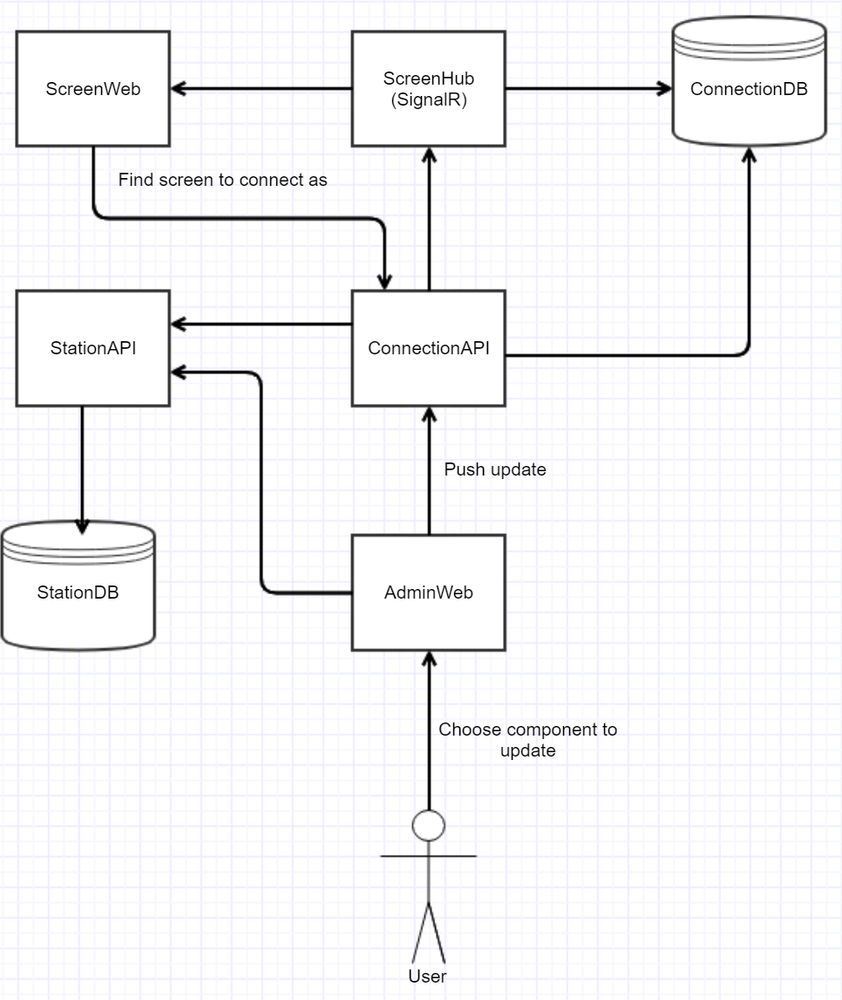

# The Choochoo project.
This is a startup project to try out ideas about updating connected browsers from an url

## Components

### Connection DB
Database that will store data about connections to the system
TODO: 
- Choose db tech
- implement db

### Connection API
This is an API for handling connections to the system. Finding current connections and pushing updates to connections
TODO:
- Security
- Implement Database for storing connections
- Check url for valid url to show on screen
- Connect to db
- Ability to update station, track or screen (now only a screen is updated)

### Station DB
Database to hold data about stations and components
TODO: 
- Choose db tech
- implement db

### Station API
This is an API for handle data about stations and components (tracks and screens)
TODO:
- Security
- Implement Database for storing connections
- Check url for valid url to show on screen
- Connect to db

### ScreenHub (SignalR)
A SignalR-hub that will push updates to the screenweb if it finds the component connected to the system
TODO:
-security
-check if connection is valid
-check if update is valid

### ScreenWeb
This is the webapplication that shows url content in a IFrame. The content can be updated by sending a post request with the station, track and/or screen to update to to the ConnectionAPI
Todo: 
- Styling
- Security
- Do some sort of choosing what to connect as in a start up screen

### AdminWeb
This is the webapplication that will let users push content and updates to screens
TODO:
- Security and Login
- Styling
- Proper homepage